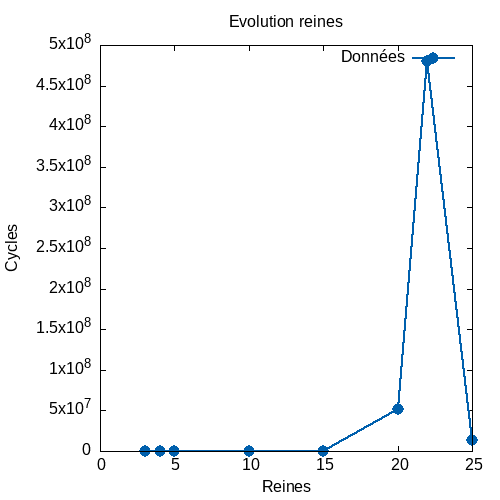

# Tp2
## Question 2

La fonction testée est celle qui parse les arguments (`parse_args`). 

Les entrées de tests ont été choisies pour tester l'un après l'autre les `if`. 
Donc si le `bon nombre d'arguments` sont rentrés et après il vérifie si l'argument entré est valable ( `entier et positif`).
En dernier il fait un test quand un argument entré est `valable`.

Actuellement les tests ne vérifient que des entiers, Un `flottant` pourrait par exemple être accepté mais `tronqué` ( sauf contrindication)

# Question bonus

## Question 4 

Pour la fonction `check_same_diagonal` nous sommes à `50%` de couverture.

Pour la fonction `check_column_ok` nous sommes à `44%` de couverture.

Pour la fonction `find_available` nous sommes à `25%` de couverture.

Pour la fonction `_find_solution` nous sommes à `57%` de couverture.

## Question 5

Plusieurs mesures répetées n'ont pas l'air stable, les cycles se réduisent à `chaque mesure`.

Pour calculer le temps il faudrait avoir la fréquence du processeur , car le `temps = cycle/fréquence`

Résultats :
- Moyenne sur 10 executions plateau de `15` = `21202444`
- Moyenne sur 10 executions plateau de `10` = `136436`
- Moyenne sur 10 executions plateau de `5` = `13380`

Je suppose que la complexité de l'algorithme est `N^2` voir `N^3`

## Question 6

On peut optimisé le code en retirant la grosse boucle principale de _find_solution, en effet, on replace la boucle for par un `tmp != -1`, donc on boucle jusqu'à qu'aucune ligne sois disponible ( donc `pas de solution trouvée`)

On obtient cette amélioration dans le rdtsc:
- Moyenne sur 10 executions plateau de `30` = `274263`
- Moyenne sur 10 executions plateau de `20` = `288785`
- Moyenne sur 10 executions plateau de `15` = `276774`
- Moyenne sur 10 executions plateau de `10` = `12458`
- Moyenne sur 10 executions plateau de `5` =  `7486`
  
La complexité est devenue assez difficile a supposée mais l'optimisation est assez évidente

